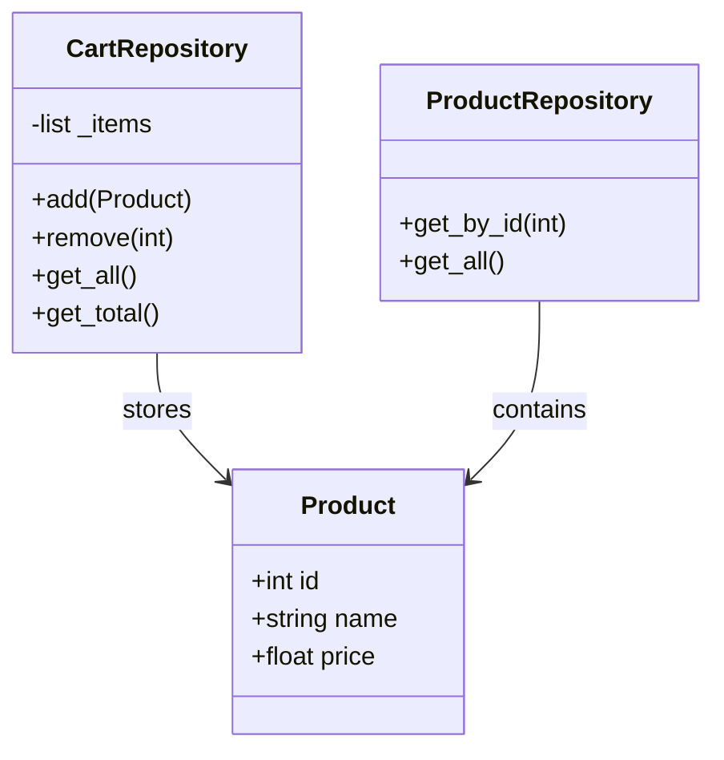

# Online Store Project

## Опис
Це навчальний проєкт онлайн-магазину, розроблений з використанням архітектурного патерну **Repository** та принципів **SOLID**. Проєкт містить повний цикл CI/CD з автоматизованим тестуванням та аналізом якості коду.

## Архітектура та Дизайн
Проєкт базується на розділенні відповідальності (Separation of Concerns).
- **Domain Layer:** Описує структуру `Product`.
- **Repository Layer:** Ізолює роботу з даними (заміна бази даних на Python-словники).
- **Service Layer:** Обробка бізнес-логіки кошика та знижок.

### UML Діаграма класів

## Встановлення
Клонуйте репозиторій:

git clone [https://github.com/ВАШ_НІК/ВАША_РЕПО.git](https://github.com/ВАШ_НІК/ВАША_РЕПО.git)
cd ur_repo

Створіть та активуйте віртуальне середовище:
python -m venv venv
source venv/bin/activate  # Для Linux/macOS
.\venv\Scripts\activate   # Для Windows

Встановіть залежності:
pip install -r requirements.txt

## Тестування
Проєкт покритий 200+ автоматизованими тестами (unit tests).

Запуск тестів:
pytest tests/

Перевірка покриття коду (coverage):
pytest --cov=src tests/
